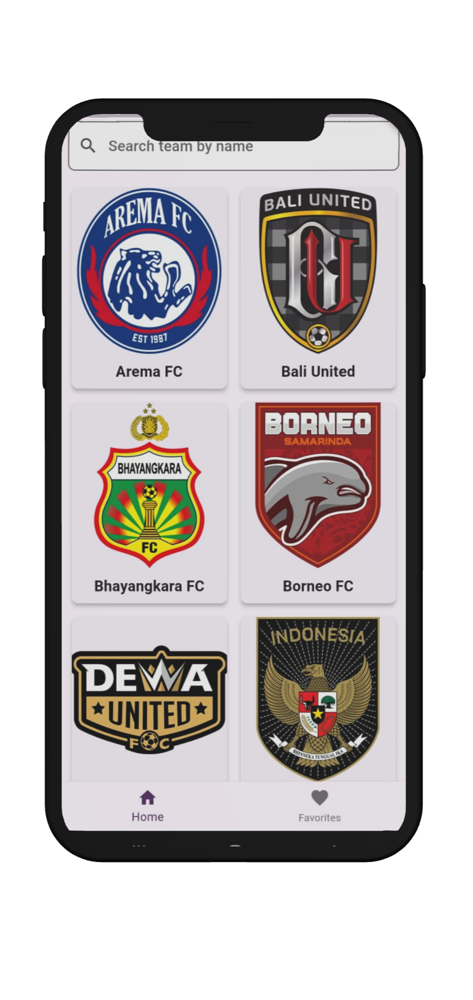
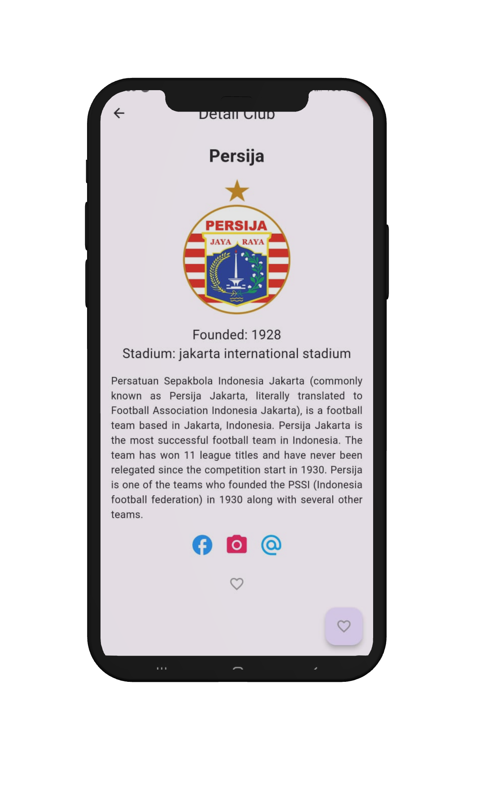
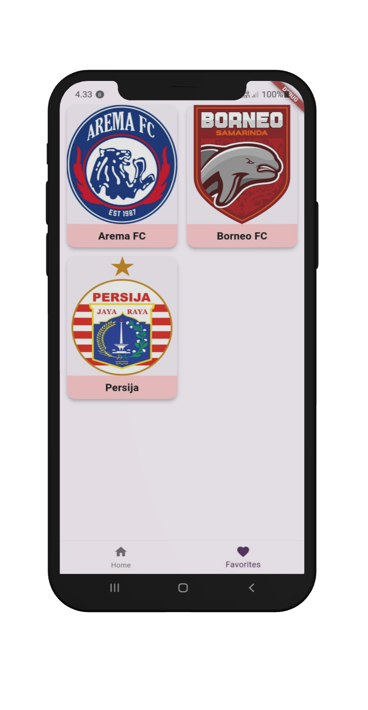

# Football Club App 

Aplikasi berbasis mobile untuk menampilkan club sepak bola yang ada di Indonesia. 

## Fitur

- [ ] Menampilkan menu navigasi : Memberikan navigasi ke pengguna untuk mengatur ke halaman list club dan list favorite. 
- [ ] Menampikan list club : Menampilkan list club sepak bola. 
- [ ] Menampilkan list favorite club pengguna : Pengguna dapat memilih club favorite dan datanya akan disimpan.
- [ ] Pencarian club : Pengguna dapat melakukan pencarian pada list club yang ada.

## Tampilan Aplikasi 
<div>
   
   
   
   
</div>

## Instalasi

### Prasyarat

Pastikan Anda memiliki perangkat dan perangkat lunak berikut:
- Flutter SDK: [Install Flutter](https://flutter.dev/docs/get-started/install)
- Android Studio atau VS Code
- Perangkat Android atau emulator

### Langkah Instalasi

1. Clone repositori ini
   ```sh
   git clone https://github.com/anantapk03/football-club-app
   
2. Instal dependencies
   ```sh
   flutter pub get
   flutter pub run flutter_launcher_icons
   
3. Jalankan aplikasi di emulator atau perangkat
   ```sh
   flutter run
